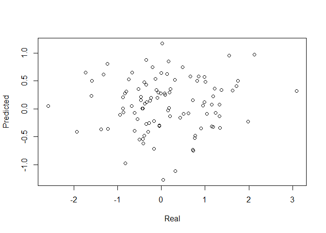

<!-- README.md is generated from README.Rmd. Please edit that file -->

# cpmr

<!-- badges: start -->

[](https://github.com/psychelzh/cpmr/actions/workflows/R-CMD-check.yaml)
[](https://app.codecov.io/gh/psychelzh/cpmr?branch=main)
<!-- badges: end -->

The cpmr package is specifically designed for the analysis of the
connectome predictive modeling (CPM) method in R. This package relies on
[Rfast](https://cran.r-project.org/web/packages/Rfast/index.html) to do
row oriented calculation.

## Installation

You can install the development version of cpmr from
[GitHub](https://github.com/) with:

``` r
# install.packages("devtools")
devtools::install_github("psychelzh/cpmr")
```

Or you can install cpmr from
[r-universe](https://psychelzh.r-universe.dev) with:

``` r
install.packages("cpmr", repos = c(getOption("repos"), "https://psychelzh.r-universe.dev"))
```

## Example

It is very simple to use this package. Just shape your connectivity
matrix as a subjects by edges matrix, i.e., each row contains the
correlation matrix (removed diagonal and duplicated values, e.g., lower
triangular data) for each subject, and your behavior data a vector and
feed them in `cpm()` function.

``` r
library(cpmr)

withr::local_seed(123)
conmat <- matrix(rnorm(100 * 1000), nrow = 100)
behav <- rnorm(100)
res <- cpm(conmat, behav, kfolds = 10)
plot(res$real, res$pred[, "both"], xlab = "Real", ylab = "Predicted")
```


